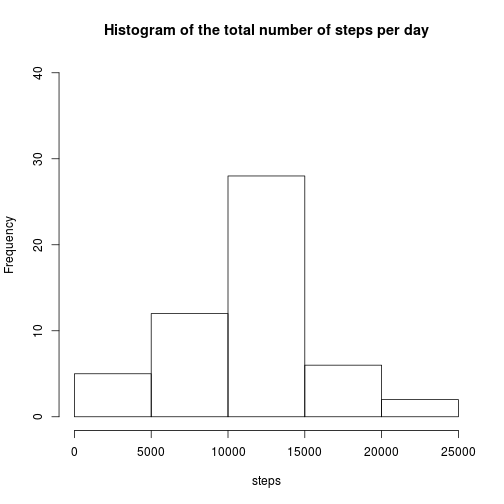
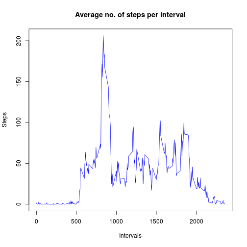
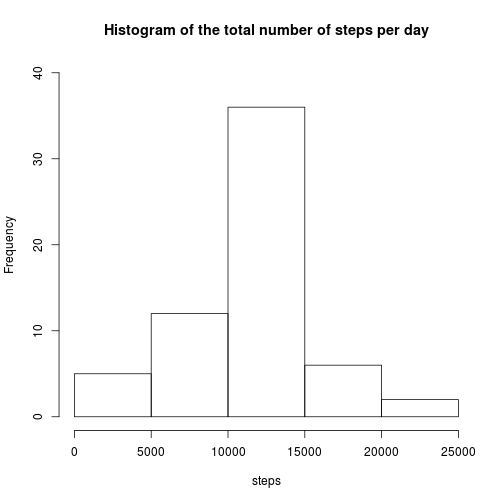
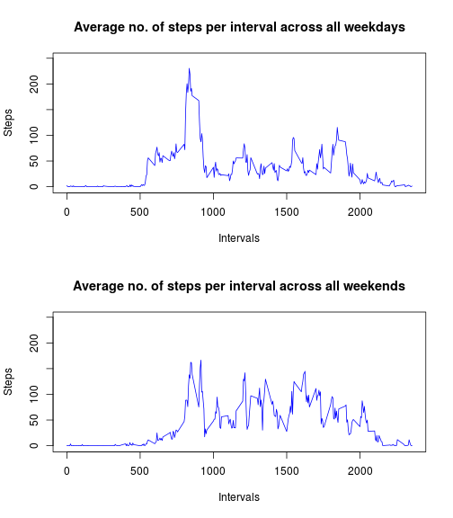

Reproducible Research: Peer Assessment 1
==========================================

## Loading and preprocessing the data
### Read data from activity.csv

```r
data=read.csv("activity.csv")
```
### Convert date from factor to date

```r
data$date=as.Date(data$date)
```

## What is mean total number of steps taken per day?
### Calculate number of steps per day

```r
perdaydata=aggregate(steps~date,data=data,sum)
head(perdaydata)
```

```
##         date steps
## 1 2012-10-02   126
## 2 2012-10-03 11352
## 3 2012-10-04 12116
## 4 2012-10-05 13294
## 5 2012-10-06 15420
## 6 2012-10-07 11015
```
### Create histogram of the total number of steps per day

```r
hist(perdaydata$steps,xlab="steps",main = "Histogram of the total number of steps per day",ylim = c(0,40))
```

 

### Calculate mean

```r
stepmean=mean(perdaydata$steps)
# round and store only upto 2 decimal places
stepmean=format(round(stepmean, 2), nsmall = 2)
stepmedian=median(perdaydata$steps)
```

The mean of total number of steps per day is 10766.19.  
The median of total number of steps per day is 10765.  

## What is the average daily activity pattern?

### Calculate average step data per slot over all days

```r
meanperslotdata=aggregate(steps~interval,data=data,FUN="mean")
head(meanperslotdata)
```

```
##   interval     steps
## 1        0 1.7169811
## 2        5 0.3396226
## 3       10 0.1320755
## 4       15 0.1509434
## 5       20 0.0754717
## 6       25 2.0943396
```

### Draw Plot


```r
plot(meanperslotdata$steps~meanperslotdata$interval,type="l",xlab="Intervals",ylab="Steps",main="Average no. of steps per interval",col="blue")
```

 


###Calculate interval that, on average across all the days in the dataset, contains the maximum number of steps.

```r
maxstepinterval=meanperslotdata[meanperslotdata$steps==max(meanperslotdata$steps),]$interval
```

That interval is the 835th interval.  

## Imputing missing values

### Calculate number of missing values in the data

```r
missingvalnum=nrow(data)-nrow(data[complete.cases(data),])
```
Number of missing values in the data are 2304.  

### Create new data with missing values replaced by average number of steps per interval accross all days

We are creating  replacing the missing values witht the average number of steps per interval accross all days  


```r
newdata<-data.frame()
for(i in 1:nrow(data)){
        if(is.na(data[i,]$steps))
        {
                step<-meanperslotdata[meanperslotdata$interval==data[i,]$interval,]$steps
                newdata<-rbind(newdata,c(step, data[i,]$date,data[i,]$interval))
                
                
        }else
        {
                
                newdata<-rbind(newdata,c(data[i,]$steps,data[i,]$date,data[i,]$interval))
              
        }
      colnames(newdata)  = colnames(data)
     
      
}
newdata$date=as.Date(newdata$date,origin="1970-01-01")
```

### Calculate number of steps per day for new data which has no missing value

```r
newperdaydata=aggregate(steps~date,data=newdata,sum)
head(newperdaydata)
```

```
##         date    steps
## 1 2012-10-01 10766.19
## 2 2012-10-02   126.00
## 3 2012-10-03 11352.00
## 4 2012-10-04 12116.00
## 5 2012-10-05 13294.00
## 6 2012-10-06 15420.00
```
### Create histogram of the total number of steps per day for new data which has no missing value

```r
hist(newperdaydata$steps,xlab="steps",main = "Histogram of the total number of steps per day",ylim = c(0,40))
```

 

### Calculate mean for new data which has no missing value

```r
newmean=mean(newperdaydata$steps)
# round and store only upto 2 decimal places
newmean=format(round(newmean, 2), nsmall = 2)
newmedian=median(newperdaydata$steps)
# round and store only upto 2 decimal places
newmedian=format(round(newmedian, 2), nsmall = 2)
```

The mean of total number of steps per day for new data is 10766.19.  
The median of total number of steps per day for new data is 10766.19.  

### Calculate diff in new and old mean and median

```r
diffmean=(as.numeric(stepmean)-as.numeric(newmean))
diffmedian=(as.numeric(stepmedian)-as.numeric(newmedian))
```

The diff in old and new mean is 0  

The diff in old and new median is -1.19  


## Are there differences in activity patterns between weekdays and weekends?

### Create factor variable for weekday

```r
newdata$weekday=""
for(i in 1:nrow(newdata)){
        if(weekdays(newdata[i,]$date) %in% c("Saturday","Sunday"))
        {
                newdata[i,]$weekday="Weekend"
        }
        else
                newdata[i,]$weekday="Weekday"
                
}

newdata$weekday=factor(newdata$weekday)

head(newdata)
```

```
##       steps       date interval weekday
## 1 1.7169811 2012-10-01        0 Weekday
## 2 0.3396226 2012-10-01        5 Weekday
## 3 0.1320755 2012-10-01       10 Weekday
## 4 0.1509434 2012-10-01       15 Weekday
## 5 0.0754717 2012-10-01       20 Weekday
## 6 2.0943396 2012-10-01       25 Weekday
```


### Calculate average steps per interval accross all Weekdays


```r
meanperslotweekdaydata=aggregate(steps~interval,data=newdata[newdata$weekday=="Weekday",],FUN="mean")
head(meanperslotweekdaydata)
```

```
##   interval      steps
## 1        0 2.25115304
## 2        5 0.44528302
## 3       10 0.17316562
## 4       15 0.19790356
## 5       20 0.09895178
## 6       25 1.59035639
```

### Calculate average steps per interval accross all Weekends


```r
meanperslotweekenddata=aggregate(steps~interval,data=newdata[newdata$weekday=="Weekend",],FUN="mean")
head(meanperslotweekenddata)
```

```
##   interval       steps
## 1        0 0.214622642
## 2        5 0.042452830
## 3       10 0.016509434
## 4       15 0.018867925
## 5       20 0.009433962
## 6       25 3.511792453
```

### Create plots for average steps per interval accross all Weekdays, Weekends

```r
par(mfrow=c(2,1))
plot(meanperslotweekdaydata$steps~meanperslotweekdaydata$interval,type="l",xlab="Intervals",ylab="Steps",main="Average no. of steps per interval across all weekdays",ylim=c(-2,250),col="blue")
plot(meanperslotweekenddata$steps~meanperslotweekenddata$interval,type="l",xlab="Intervals",ylab="Steps",main="Average no. of steps per interval across all weekends",ylim=c(-2,250),col="blue")
```

 
